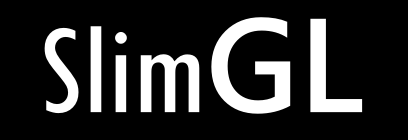

 

 

Minimalist interactive OpenGL based render engine andapplication framework. 
Written from scratch in C++.
Focuses on simplicity, ease of use and setup with no dependencies and an optional single header file variant 
 
Built on: [SlimEngine++](https://github.com/HardCoreCodin/SlimEngineCpp)  

For related projects, see [my portfolio](https://hardcorecodin.com/portfolio). 

Features:
-
All features of <b>SlimEngine++</b> are available here as well. 
Additional features include lighting and rendering facility: 
- PBR: Physically Based Rendering with Cook Torrance shading model
- IBL: Image Based Lighting with Radiance and Irradiance Cube Maps
- SkyBox and Reflection Cube Maps
- Directional Lights with orthographic Directional Shadow Maps
- Point Lights and Spot Lighs with Omni-Directional Shadow Maps (Cube Maps)
- Normal Mapping

Architecture:
-
The platform layer only uses operating-system headers (no standard library used). 
The application layer itself has no dependencies, apart from the standard math header. 
It is just a library that the platform layer uses - it has no knowledge of the platform. 

More details on this architecture [here](https://youtu.be/Ev_TeQmus68).

Usage:
-
The main entry point for the app needs to be defined explicitly (see [SlimApp](https://github.com/HardCoreCodin/SlimApp)).  

SlimGL comes with pre-configured CMake targets for all examples. 
For manual builds on Windows, the typical system libraries need to be linked 
(winmm.lib, gdi32.lib, shell32.lib, user32.lib) and the SUBSYSTEM needs to be set to WINDOWS 

SlimGL does not come with any GUI functionality at this point. 

All examples are interactive using <b>SlimGL</b>'s facilities having 2 interaction modes:
1. FPS navigation (WASD + mouse look + zooming) 
2. DCC application (default) 

Double clicking the `left mouse button` anywhere within the window toggles between these 2 modes.<btr>

Entering FPS mode captures the mouse movement for the window and hides the cursor. 
Navigation is then as in a typical first-person game (plus lateral movement and zooming): 

Move the `mouse` to freely look around (even if the cursor would leave the window border) 
Scroll the `mouse wheel` to zoom in and out (changes the field of view of the perspective) 
Hold `W` to move forward 
Hold `S` to move backward 
Hold `A` to move left 
Hold `D` to move right 
Hold `R` to move up 
Hold `F` to move down 

Exit this mode by double clicking the `left mouse button`.

The default interaction mode is similar to a typical DCC application (i.e: Maya): 
The mouse is not captured to the window and the cursor is visible. 
Holding the `right mouse button` and dragging the mouse orbits the camera around a target. 
Holding the `middle mouse button` and dragging the mouse pans the camera (left, right, up and down). 
Scrolling the `mouse wheel` dollys the camera forward and backward. 

Clicking the `left mouse button` selects an object in the scene that is under the cursor. 
Holding the `left mouse button` while hovering an object and then dragging the mouse, 
moves the object parallel to the screen. 

Holding `alt` highlights the currently selecte object by drawing a bounding box around it. 
While `alt` is still held, if the cursor hovers the selected object's bounding box, 
mouse interaction transforms the object along the plane of the bounding box that the cursor hovers on: 
Holding the `left mouse button` and dragging the mouse moves the object. 
Holding the `right mouse button` and dragging the mouse rotates the object. 
Holding the `middle mouse button` and dragging the mouse scales the object. 
<i>(`mouse wheel` interaction is disabled while `alt` is held)</i> 

* <b><u>obj2mesh</b>:</u> Also privided is a separate CLI tool for converting `.obj` files to `.mesh` files. 
  Usage: `./obj2mesh src.obj trg.mesh` 
  - invert_winding_order : Reverses the vertex ordering (for objs exported with clockwise order) 

* <b><u>bmp2texture</b>:</u> Also provided is a separate CLI tool for converting `.bmp` files to `.texture` files. 
  Usage: `./bmp2texture src.bmp trg.texture` 
  - f : Flip vertically 
  - n : Normal map 
  - l : Linear 
  - t : Tile 
  - m : MipMap 
  - c : CubeMap 

* <b><u>stb2image</b>:</u> Also provided is a separate CLI tool for converting many image file formats to `.image` files. 
  Usage: `./bmp2texture src.png trg.image` 
  - f : Flip vertically 
  - n : Normal map 
  - l : Linear 
  - b : Store as bytes per channel 
